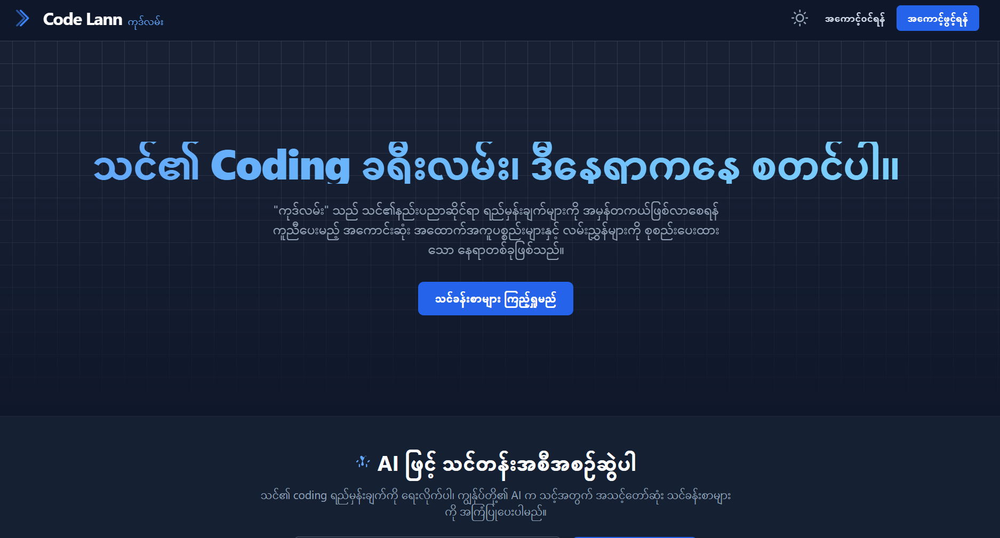
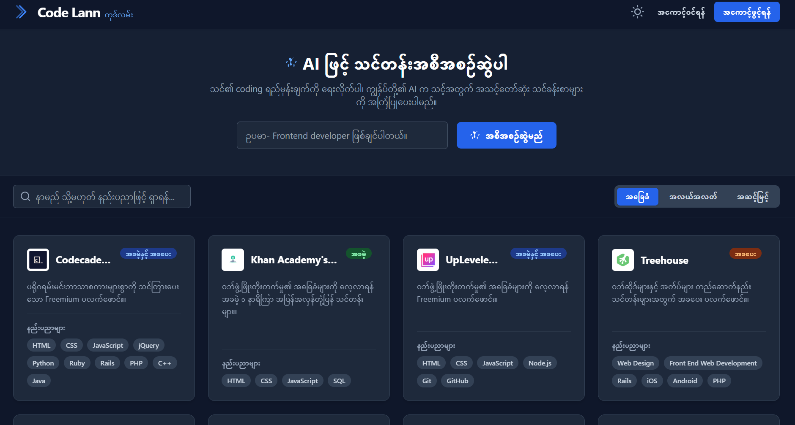
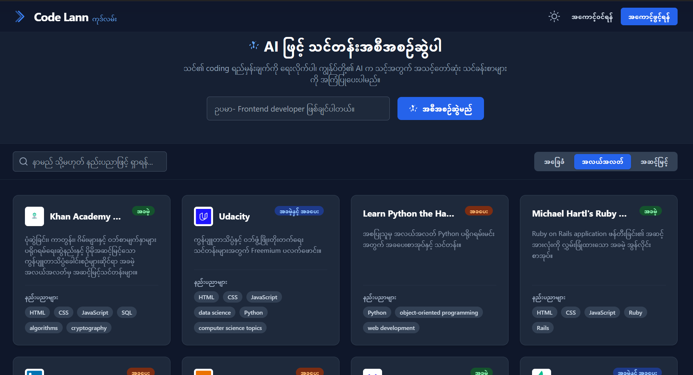
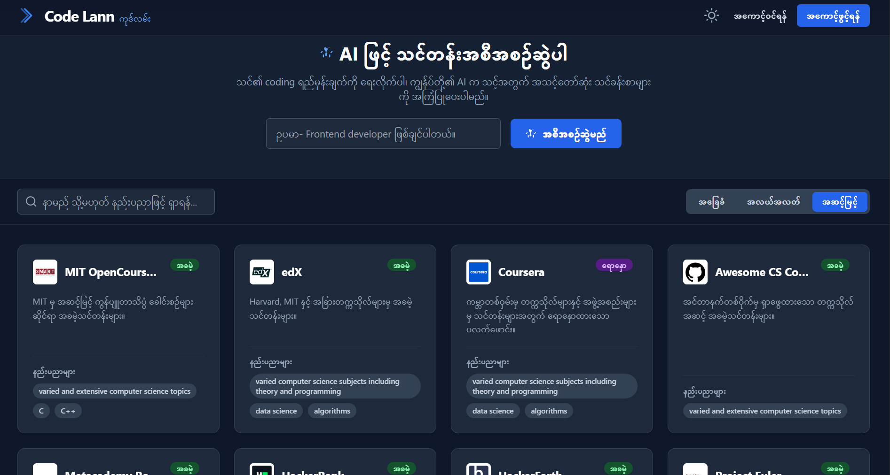

# Run and deploy your Code Lann app

သင်၏ coding ခရီးလမ်းအတွက် အကောင်းဆုံး ပလက်ဖောင်း။ ဝဘ်ဖွံ့ဖြိုးတိုးတက်ရေး၊ ဒေတာသိပ္ပံနှင့် အခြားအရာများအတွက် အကောင်းဆုံးသင်တန်းများကို ရှာဖွေပြီး သင်၏တိုးတက်မှုကို ခြေရာခံပါ။

This contains everything you need to run your app locally.

    

    

    

    

## Run Locally

**Prerequisites:**  Node.js

1. Install dependencies:
   `npm install`
2. Set the `GEMINI_API_KEY` in [.env.local](.env.local) to your Gemini API key
3. Run the app:
   `npm run dev`

### 🌐 Connect with me

- 💼 [LinkedIn](https://www.linkedin.com/in/peter-sawm-06932b254/)
- 💻 [GitHub](https://github.com/petersawmtech)
- 🌍 [Facebook](https://www.facebook.com/petersawm25)

---

Made with ❤️ by Peter Sawm
